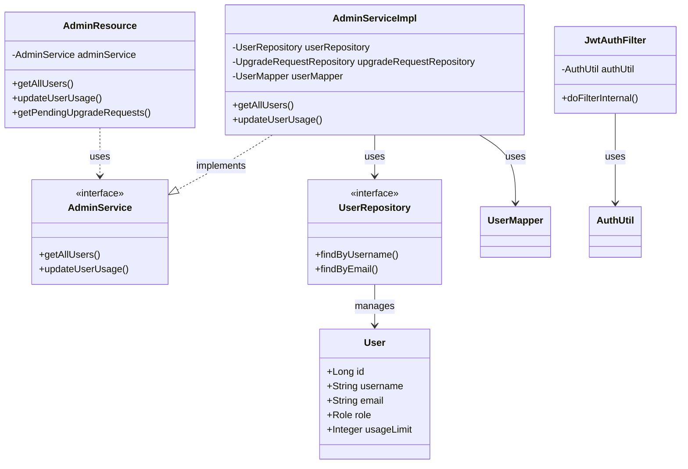
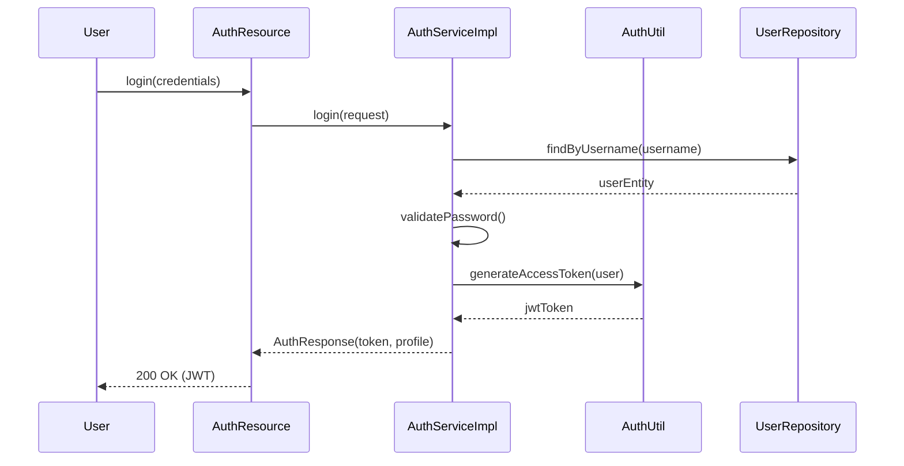
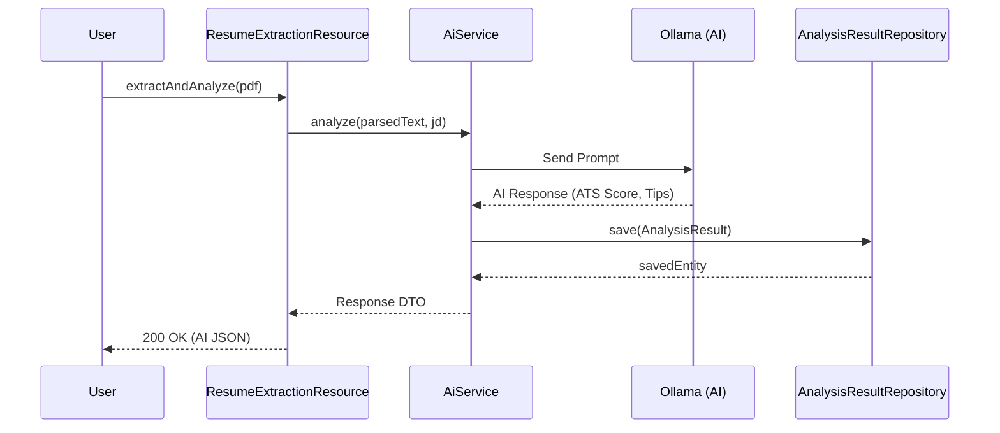

# Backend UML Design - ResumeAi

## 1. Class Diagram (Core Backend Services)
This diagram illustrates the relationship between controllers, services, repositories, and the security layer.

## 2. Authentication Flow (UML Sequence)

## 3. Resume Analysis Flow

