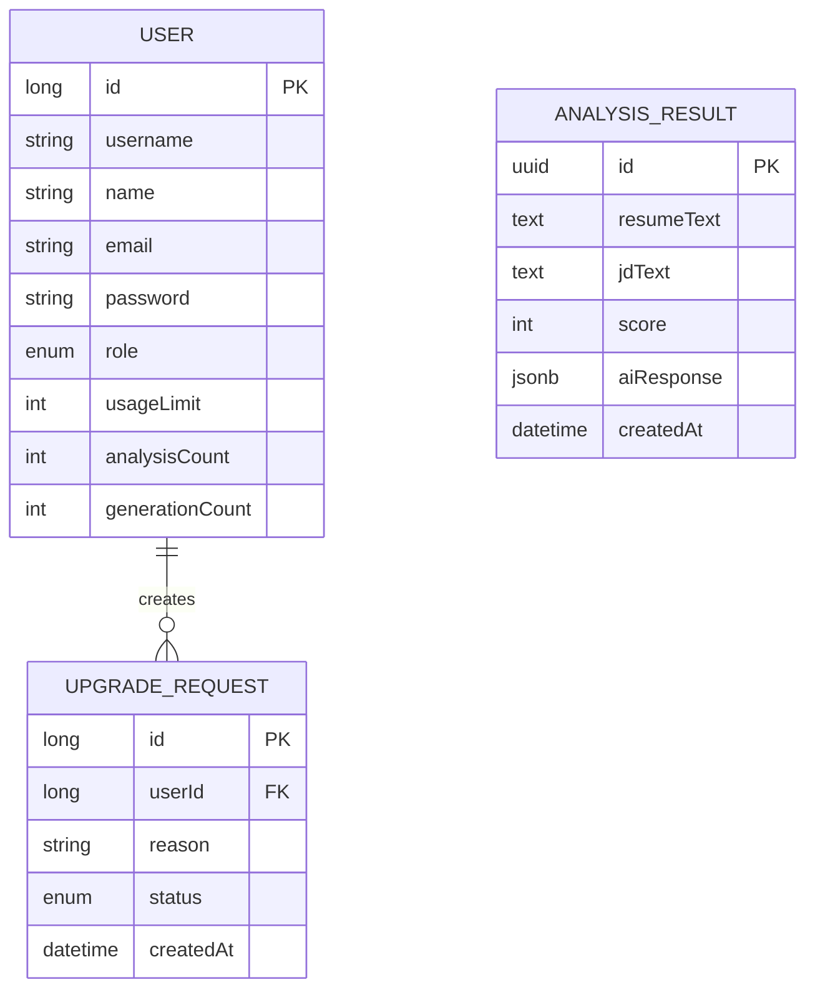
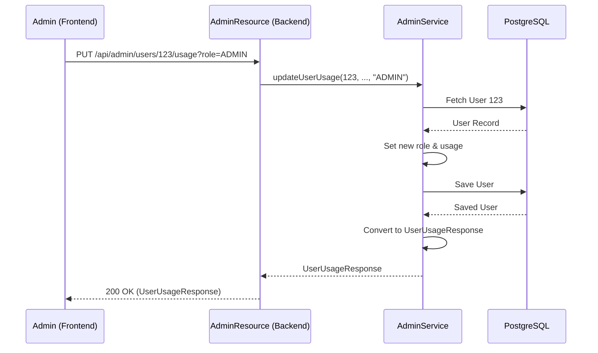
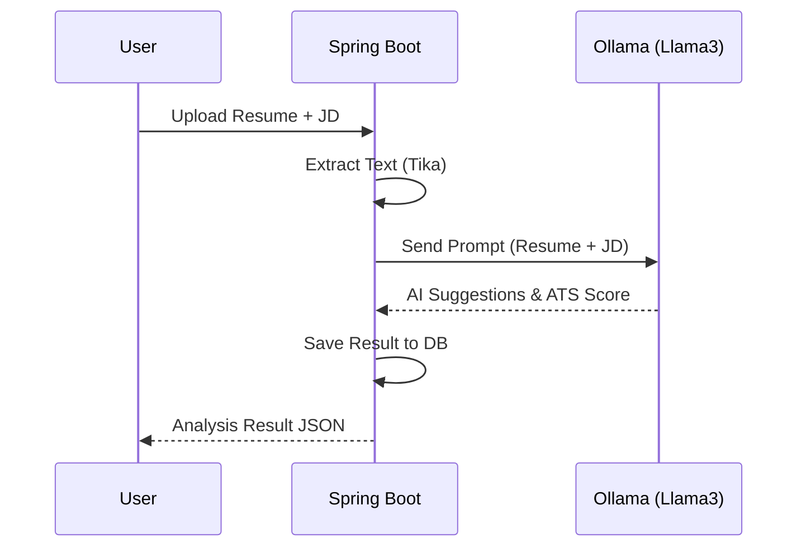

# System Diagrams - ResumeAi

## 1. Entity Relationship (ER) Diagram

```mermaid
erDiagram
    USER ||--o{ UPGRADE_REQUEST : creates
    USER {
        long id PK
        string username
        string name
        string email
        string password
        enum role
        int usageLimit
        int analysisCount
        int generationCount
    }
    UPGRADE_REQUEST {
        long id PK
        long userId FK
        string reason
        enum status
        datetime createdAt
    }
    ANALYSIS_RESULT {
        uuid id PK
        text resumeText
        text jdText
        int score
        jsonb aiResponse
        datetime createdAt
    }
```

## 2. Sequence Diagram: Admin User Management

```mermaid
sequenceDiagram
    participant Admin as Admin (Frontend)
    participant API as AdminResource (Backend)
    participant Service as AdminService
    participant DB as PostgreSQL

    Admin->>API: PUT /api/admin/users/123/usage?role=ADMIN
    API->>Service: updateUserUsage(123, ..., "ADMIN")
    Service->>DB: Fetch User 123
    DB-->>Service: User Record
    Service->>Service: Set new role & usage
    Service->>DB: Save User
    DB-->>Service: Saved User
    Service->>Service: Convert to UserUsageResponse
    Service-->>API: UserUsageResponse
    API-->>Admin: 200 OK (UserUsageResponse)
```

## 3. Sequence Diagram: AI Resume Analysis

```mermaid
sequenceDiagram
    participant User
    participant BE as Spring Boot
    participant AI as Ollama (Llama3)

    User->>BE: Upload Resume + JD
    BE->>BE: Extract Text (Tika)
    BE->>AI: Send Prompt (Resume + JD)
    AI-->>BE: AI Suggestions & ATS Score
    BE->>BE: Save Result to DB
    BE-->>User: Analysis Result JSON
```
