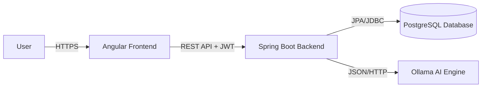

# High-Level Design (HLD) - ResumeAi

## 1. Introduction
ResumeAi is an AI-powered platform designed to help job seekers optimize their resumes, analyze them against job descriptions (JD), and improve their chances of passing Applicant Tracking Systems (ATS).

## 2. Objective
- To provide an automated ATS scoring system.
- To generate tailored cover letters and optimized resumes.
- To manage user usage and administrative controls.

## 3. Technology Stack
- **Frontend**: Angular 20 (Standalone Components), PrimeNG, TailwindCSS (for custom styles).
- **Backend**: Spring Boot 3.5.x (Java 21).
- **AI Engine**: Spring AI with Ollama (Llama/Mistral models).
- **Database**: PostgreSQL (with JSONB support for AI responses).
- **Security**: Spring Security 6, JWT-based Authentication.
- **Documentation**: Markdown, Mermaid.

## 4. System Architecture
The system follows a Client-Server architecture:
- **Client**: Single Page Application (SPA) built with Angular.
- **Server**: RESTful API built with Spring Boot.
- **AI Layer**: Local AI inference via Ollama.

### Architectural Diagram (Conceptual)

## 5. Major Modules
- **Authentication & Authorization**: JWT token management, Role-Based Access Control (RBAC).
- **Resume Processing**: Text extraction from PDFs (via Tika), JD analysis.
- **AI Orchestration**: Prompt management and model interaction.
- **Admin Management**: User usage tracking, upgrade request workflows.
- **Communication**: Email service for sending documents.

## 6. Infrastructure & Deployment
- **Database**: Managed PostgreSQL instance.
- **Backend**: Containerized Spring Boot application.
- **Frontend**: Static hosting (Vercel/Netlify/S3).
- **AI**: Local or remote Ollama server.
